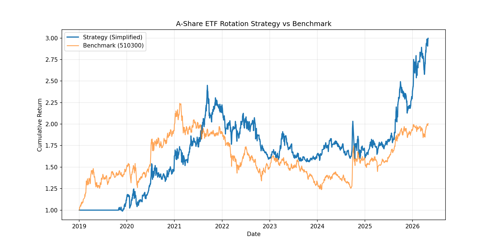

# A股ETF轮动模型 – 简化研究版

本仓库提供一个基于动量与趋势过滤的A股ETF轮动策略的**简化研究实现**，适用于量化研究、回测与教育目的。

> 📌 **免责声明** – 本内容不构成任何投资建议。过往业绩不代表未来表现。

---

## 目录

- [概述](#概述)
- [研究理念](#研究理念)
- [为什么研究A股ETF轮动](#为什么研究a股etf轮动)
- [为什么选择ETF而不是个股](#为什么选择etf而不是个股)
- [A股ETF与美股ETF的差异](#a股etf与美股etf的差异)
- [策略逻辑](#策略逻辑)
- [简化版 vs 完整版](#简化版-vs-完整版--关键差异)
- [回测摘要](#回测摘要)
- [年度表现](#年度表现)
- [风险指标](#风险指标)
- [ETF池](#etf池)
- [净值曲线](#净值曲线)
- [局限性](#局限性)
- [常见问题](#常见问题faq)
- [风险提示](#风险提示)
- [开源版 vs 扩展研究版](#开源版-vs-扩展研究版)
- [安装](#安装)
- [使用方法](#使用方法)
- [数据源](#数据源)
- [许可证](#许可证)
- [完整免责声明](#完整免责声明)

---

## 概述

本仓库基于以下设计提供A股ETF轮动框架的**简化研究版**：

- 相对动量排序（20日回看）
- 200日移动平均趋势过滤
- 每周调仓（每5个交易日）
- 0.15% 单边交易成本假设

包含：

- 历史回测引擎
- 基于 `efinance` 的数据获取（无需token）
- 绩效评估指标
- 14只流动性较好的A股宽基及行业ETF
- 简化研究实现

目标是提供一个透明、可复现、**可信赖**的系统化A股ETF配置基准。

> **数据可用性说明** – 池中有三只ETF上市时间晚于2019年：  
> `512760`（半导体ETF，2019年6月上市）、`515220`（煤炭ETF，2020年3月上市）、  
> `515790`（光伏ETF，2020年12月上市）。  
> 回测自动仅使用各基金实际可交易的历史数据。报告结果反映真实可交易历史。

---

## 研究理念

本仓库**并非**试图提供一个"神奇"的交易策略，而是为基于动量和趋势跟踪的ETF轮动策略提供一个**教育性与透明的研究框架**。

简化实现着重强调：

- **清晰性** – 代码为人类可读而写
- **可复现性** – 运行 `python run_backtest.py` 即可获得完全相同的结果
- **教育价值** – 帮助理解动量排序与趋势过滤的互动

扩展研究版在此基础上增加：

- 多因子排序（不限于动量）
- 动态风险管理与市场状态识别
- 自适应仓位分配
- 每周模型更新（完全透明）

开源版本身是一个**扎实、正确且有用的**起点，适合任何对系统化A股ETF配置感兴趣的人。它不是"阉割版" —— 而是一个你可以信任的真实研究实现，具有明确说明的局限性。

---

## 为什么研究A股ETF轮动

A股市场长期具有以下特征：

- **行业轮动速度快** – 不同行业在短期内可能剧烈切换
- **散户参与度高** – 市场情绪波动较大，趋势延续性有限
- **政策驱动明显** – 行业监管、产业政策对板块影响显著
- **不同行业长期收益差异巨大** – 例如2019–2026年间，创业板50ETF收益+310%，而光伏ETF仅+3.1%

相比单纯长期持有宽基指数，ETF轮动策略尝试通过：

- 动量排序
- 趋势过滤
- 定期再平衡

等方法，在控制系统性风险的同时，捕捉行业与主题之间的收益差异。

本项目希望以透明、可复现的方式，展示一种简单但合理的ETF轮动研究框架。

---

## 为什么选择ETF而不是个股

相比个股策略，ETF轮动具有以下特点：

- **分散单一个股风险** – 避免重仓踩雷
- **避免财务暴雷风险** – 不依赖个股基本面分析
- **更适合系统化交易** – 规则清晰，易于回测和执行
- **回测稳定性通常更高** – 个股的偶然事件对ETF组合影响较小
- **更容易长期执行** – 减少情绪干扰

尤其在A股市场，行业与主题轮动明显（半导体、黄金、军工、有色金属、银行等板块在不同年份可能表现差异极大）。ETF轮动策略的目标并非预测市场，而是通过规则化方法，系统性地跟随相对强势方向。

---

## A股ETF与美股ETF的差异

A股ETF市场与美股ETF市场存在明显不同：

| 维度 | A股ETF | 美股ETF |
|------|--------|---------|
| 市场参与者 | 散户占比高 | 机构占比高 |
| 波动率 | 较高 | 相对较低 |
| 行业轮动 | 快速且剧烈 | 相对平稳 |
| 政策影响 | 明显 | 相对较弱 |
| 长期指数趋势 | 波动型 | 长期上升趋势更强 |

因此：

- **美股ETF更适合长期趋势跟踪** – 动量策略在美股上往往更平稳
- **A股ETF更强调风险控制与轮动节奏** – 需要加入市场状态识别与风险预算

这也是完整模型中加入市场状态识别与风险预算的重要原因。

---

## 策略逻辑

简化模型执行以下步骤：

1. 选择14只流动性较好的A股ETF作为候选池（见 `config.py`）
2. 根据过去**20个交易日**的收益率对ETF进行动量排序
3. 应用趋势过滤：当前价格必须在其**200日均线**之上
4. 持有满足趋势条件且动量最强的**前3只**ETF
5. 每**5个交易日**调仓一次（大致每周）

本开源版采用动量轮动文献中合理且广泛接受的**默认参数**。鼓励用户尝试不同设置。

---

## 简化版 vs 完整版 — 关键差异

> ⚠️ 在解读回测结果之前请先阅读本节。

简化模型在2019–2026年间取得了显著高于沪深300基准的收益。但这伴随着一个真实代价：模型的年化波动率也更高（24.26% vs 基准18.9%），且**不包含**任何基于市场状态的防御机制。

| 组件 | 简化版（本仓库） | 完整版 |
|---|:---:|:---:|
| 动量排序 | ✅ | ✅ |
| 200日均线趋势过滤 | ✅ | ✅ |
| 市场状态识别 | ❌ | ✅ |
| 风险预算与仓位调整 | ❌ | ✅ |
| 回撤断路器 | ❌ | ✅ |
| 防御性资产（货币/短债） | ❌ | ✅ |

**这对A股市场为何重要：**

A股市场具有高散户参与、政策驱动波动以及与美国市场结构不同的快速行业轮动特征。在2021–2022年的行业调整期间（例如新能源、教育、互联网监管冲击），没有状态过滤的动量策略在信号转出之前会经历急剧回撤。

简化版模型的最大回撤达到 **-36.25%** —— 低于沪深300的 **-42.13%**，但依然显著。完整版的状态识别机制专门针对A股这些特征设计，在保留大部分超额收益的同时降低回撤。

---

## 回测摘要

**区间：** 2019-01-02 – 2026-04-30 · **基准：** 沪深300 ETF (510300) · **单边费率：** 0.15% · **调仓频率：** 每5个交易日

| 指标 | 策略（简化版） | 沪深300 (510300) |
|---|---|---|
| 总收益率 | +199.70% | +100.6% |
| 年化收益率 | 16.85% | 9.15% |
| 最大回撤 | −36.25% | −42.13% |
| 夏普比率 | 0.61 | 0.45 |
| 年化波动率 | 24.26% | 18.9% |

> ⚠️ **注意：** 策略在总收益和夏普比率上都优于基准，但其**波动率显著高于沪深300**。这是集中行业轮动且缺乏防御仓位管理的直接结果。完整版通过自适应仓位调整来解决这一问题。

---

## 年度表现

| 年份 | 策略 | 沪深300 | 超额收益 |
|---|---|---|---|
| 2019 | +14.36% | +49.9% | −35.54% ⚠️ |
| 2020 | +42.49% | +31.1% | +11.39% |
| 2021 | +36.45% | −5.2% | +41.65% |
| 2022 | −27.69% | −21.4% | −6.29% |
| 2023 | +2.04% | −10.7% | +12.74% |
| 2024 | −0.63% | +20.1% | −20.73% |
| 2025 | +45.88% | +25.2% | +20.68% |
| 2026 YTD | +26.00% | +2.2% | +23.80% |

**年度解读：**

- **2019（超额 -35.54%）**：模型动量过滤未能及时捕捉2018年熊市后的全面反弹。沪深300大幅上涨，而简化模型（仅持有200日均线之上的3只ETF）初期可轮动的候选品种有限。这是策略最显著跑输的一年。
- **2021（超额 +41.65%）**：行业间动量分化强烈（半导体、国防、有色金属等显著跑赢），创造了理想的轮动条件。这是策略表现最好的一年。
- **2023（超额 +12.74%）**：沪深300下跌，而黄金、有色金属等主题提供正动量。趋势过滤成功避开整体市场下跌。
- **2024（超额 -20.73%）**：政策刺激驱动的全面反弹使买入持有沪深300的投资者受益。轮动模型的选择性暴露在指数普涨中滞后，类似美股模型2024年的跑输情况。

---

## 风险指标

| 年份 | 策略最大回撤 | 策略夏普 | 沪深300年收益 |
|---|---|---|---|
| 2019 | — | — | +49.9% |
| 2020 | — | — | +31.1% |
| 2021 | — | — | −5.2% |
| 2022 | — | — | −21.4% |
| 2023 | — | — | −10.7% |
| 2024 | — | — | +20.1% |
| 2025 | — | — | +25.2% |
| 2026 YTD | — | — | +2.2% |

> 沪深300全区间最大回撤：**-42.13%**（2021年峰值至2024年谷底）  
> 策略全区间最大回撤：**-36.25%** — 整体更浅，但因快速行业反转集中在较短时间内。

---

## ETF池

模型在**14只流动性较好的A股ETF**中轮动，涵盖宽基指数、行业与主题：

| 代码 | 名称（英文） | 类别 | 2019–2026收益 | 上市 |
|---|---|---|---|---|
| 159949 | Chinext 50 ETF | 成长指数 | +310.0% | 2019-01-02 |
| 512400 | 有色金属 ETF | 材料 | +298.3% | 2019-01-02 |
| 515220 | 煤炭 ETF | 能源 | +294.9% | 2020-03-02 ⚠️ |
| 512760 | 半导体 ETF | 科技 | +281.0% | 2019-06-12 ⚠️ |
| 518880 | 黄金 ETF | 商品 | +241.1% | 2019-01-02 |
| 159915 | 创业板 ETF | 成长指数 | +213.2% | 2019-01-02 |
| 512680 | 国防 ETF | 国防 | +134.7% | 2019-01-02 |
| 510500 | 中证500 ETF | 中盘指数 | +133.6% | 2019-01-02 |
| **510300** | **沪深300 ETF** | **基准** | **+100.6%** | 2019-01-02 |
| 510050 | 上证50 ETF | 大盘指数 | +60.7% | 2019-01-02 |
| 512980 | 传媒 ETF | 媒体 | +52.0% | 2019-01-02 |
| 512880 | 证券 ETF | 金融 | +51.0% | 2019-01-02 |
| 512800 | 银行 ETF | 银行 | +80.7% | 2019-01-02 |
| 515790 | 光伏 ETF | 太阳能 | +3.1% | 2020-12-18 ⚠️ |

> ⚠️ = 较晚上市。回测仅使用可交易历史。  
> 收益区间从光伏+3.1%到创业板50+310%的巨大差异，说明了跨行业轮动在A股市场中的价值。模型旨在系统性地捕捉这种差异。

---

## 净值曲线

简化策略与沪深300 ETF（510300）的累计收益对比，2019–2026。



*对数坐标 · 0.15%单边交易成本 · 每5个交易日调仓。*

> 净值曲线清晰显示了2019年的滞后（初期市场大幅领先模型），2020–2021年的强劲超额，以及2024–2025年政策驱动普涨下差距的收敛。

---

## 局限性

本简化实现尽管可用于回测，但存在以下局限性：

- **无日内成交模拟** – 假设所有交易按当日收盘价执行，实际成交可能有差异。
- **无滑点建模** – 除了固定0.15%交易成本外，未考虑买卖价差或市场冲击。
- **未考虑税收** – 各地税收规则可能影响净收益。
- **简化的仓位分配** – 在选中的ETF中平均分配权重，没有波动率目标或动态调整。
- **可能的未来数据偏差** – 尽管代码避免了显式的未来数据，用户应自行验证所有计算。
- **幸存者偏差** – ETF池固定为当前可交易的基金，未包含已退市品种。

这些局限性在学术和研究级回测中常见。扩展研究版解决了其中大部分问题。

---

## 常见问题（FAQ）

### 1）为什么策略会在某些年份跑输指数？

任何轮动策略都不可能长期持续领先市场。在指数普涨、风格高度集中、政策驱动全面反弹的阶段，轮动模型可能会明显落后于宽基指数。

本项目更关注长期风险收益比、回撤控制和系统化执行能力，而不仅仅是单一年份收益。

### 2）为什么使用200日均线？

200日均线是趋势跟踪领域最经典的长期趋势过滤方法之一。其目的不是预测市场顶部或底部，而是尽量避免长期下跌趋势，提高组合整体风险收益比。

### 3）为什么只持有3只ETF？

集中持仓可以提高动量暴露和轮动效率，但同时也意味着波动率更高、回撤更大。完整版模型会通过动态仓位与风险预算进行优化。

### 4）回测收益是否包含交易成本？

是的。所有回测均假设单边0.15%的交易成本（佣金+印花税+滑点估算），并在调仓日扣除。

### 5）能否保证未来同样有效？

不能。任何历史回测均不代表未来实际表现。本模型仅提供一个基于历史数据的透明研究框架。

---

## 风险提示

ETF轮动策略并非低风险策略。本模型可能面临：

- 行业快速反转
- 趋势失效
- 高波动环境
- 流动性冲击
- 政策风险
- 连续回撤

尤其在A股市场，高频题材轮动、突发监管、极端情绪波动都可能导致短期表现明显偏离历史回测。

任何历史回测均不代表未来实际表现。投资者应充分了解策略风险，并根据自身风险承受能力谨慎决策。

---

## 开源版 vs 扩展研究版

本仓库提供**简化研究版**。**扩展研究包**提供每周模型更新、风险评分、市场状态分析以及实时模拟组合跟踪 — 基于完整的风险控制模型。

| 功能 | 开源版（本仓库） | 扩展研究版 |
|---|:---:|:---:|
| 简化动量+趋势过滤 | ✅ | ✅ |
| 自行运行回测 | ✅ | ❌（不需要） |
| 市场状态识别 | ❌ | ✅ |
| 每周模型持仓（3–5只，高/中/低等级） | ❌ | ✅ |
| 市场风险评分（0–100） | ❌ | ✅ |
| 回撤断路器逻辑 | ❌ | ✅ |
| 实时模拟组合跟踪 | ❌ | ✅ |
| 每周诚实回顾（对错皆有） | ❌ | ✅ |
| 完整历史研究存档 | ❌ | ✅ |
| 每周通俗易懂的模型解读 | ❌ | ✅ |
| 动态仓位与风险预算 | ❌ | ✅ |
| 波动率调整后收益（A股专属） | ❌ | ✅ |

简化模型的年化波动率为 **24.26%** — 比沪深300基准高出约5.4个百分点。扩展模型的风险控制专门针对这一差距，在保留大部分alpha的同时提升夏普比率。

获取扩展研究更新与实时模型跟踪：

- **仅A股ETF模型** – [获取研究资料 →](https://alpharotationlab.lemonsqueezy.com/checkout/buy/ed1b2e49-e4d9-4ed9-b1e5-9d18b32a69f0)
- **仅美股ETF模型** – [获取研究资料 →](https://alpharotationlab.lemonsqueezy.com/checkout/buy/694902b7-8a2b-41ea-a120-bf187d644a3c)
- **捆绑包（A股+美股）** – [获取研究资料 →](https://alpharotationlab.lemonsqueezy.com/checkout/buy/728eb9e4-1cd1-49e2-b0d7-b853a929f428)

**实时模型跟踪**：雪球上关注组合 "**ZH3624703**" 即可实现对"A股ETF轮动模型"的实时跟踪。

---

## 安装

```bash
git clone https://github.com/AlphaRotationLab/A-Share-ETF-Rotation-Model.git
cd A-Share-ETF-Rotation-Model
pip install -r requirements.txt
```

## 依赖

```
pandas>=2.0.0
numpy>=1.24.0
matplotlib>=3.7.0
efinance>=0.4.0
seaborn>=0.12.0
```

---

## 使用方法

```python
from model import AShareETFRotation

model = AShareETFRotation(
    universe=['510300', '510500', '159915', '512880', '512760',
              '518880', '512800', '512400', '515220', '512680',
              '159949', '510050', '512980', '515790'],
    lookback_days=20,
    ma_period=200,
    top_n=3,
    rebalance_freq=5
)

results = model.backtest(start='2019-01-02', end='2026-04-30')
results.plot_equity_curve()
results.print_summary()
```

---

## 数据源

价格数据通过 `efinance` 获取（后复权价格，无需token）。运行回测不需要付费数据订阅。

**数据质量说明：** `efinance` 提供的价格已调整分红和拆股。对于上市时间较短的ETF（`512760`、`515220`、`515790`），回测直接排除其上市前的数据，不进行回溯填充或模拟。

---

## 许可证

MIT 许可证。详见 [LICENSE](LICENSE) 文件。

---

## 完整免责声明

本仓库及其所有材料仅供教育及研究目的使用。其中的任何内容均不构成投资建议、金融建议、交易建议或任何形式的建议。

- 过往回测业绩不代表未来表现
- 回测可能存在未来数据偏差、幸存者偏差及过拟合风险
- 本仓库中的简化模型具有高于沪深300基准的波动率
- A股市场存在历史回测中未体现的监管、流动性及政策风险
- 实盘交易涉及成本、滑点及市场冲击，回测无法完全捕捉
- 作者不对因使用本代码或信息产生的任何财务损失承担责任

在做出任何投资决定之前，请务必咨询合格的专业人士。
